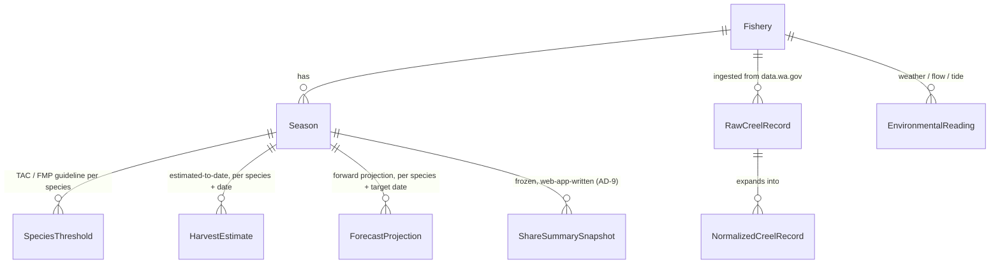

# Architecture Spine — fishcast

## Design Paradigm

**CQRS-lite.** A scheduled pipeline is the sole command/write side: it ingests creel and environmental data and runs the estimation/forecasting model, persisting results to Postgres. The Django web app is the read side: it queries Postgres and renders the Manager, Angler, and Forecast Accuracy views — it never computes a forecast or expands a raw count itself. The one deliberate exception is Share Summary (AD-9): the web app's single permitted write.

```mermaid
flowchart LR
    subgraph Command side — GitHub Actions, daily
        ING[Ingestion: data.wa.gov / NOAA / USGS] --> ORC[Python orchestrator]
        ORC -- flat file --> R[R/Stan: PE + BSS estimation]
        R -- flat file --> ORC
    end
    ORC -->|upsert| PG[(Postgres)]
    PG -->|read-only| WEB[Django web app — Vercel]
    WEB -->|write: ShareSummarySnapshot only| PG
```

Two units one level down (e.g. a future ingestion module and a future view module) cannot diverge on *who computes a number* — only the command side ever does, so a divergent "convenience" forecast added inside a view is the violation this paradigm exists to prevent.

## Invariants & Rules

### AD-1 — Command/query split

- **Binds:** all
- **Prevents:** forecasting/estimation logic duplicated or drifting between a request-time path and the batch path.
- **Rule:** Only the pipeline (orchestrator + R estimation step) may compute or write `HarvestEstimate` / `ForecastProjection` / `NormalizedCreelRecord` / `EnvironmentalReading` rows. The Django app reads these tables; it never derives a harvest number inline.

### AD-2 — Pipeline runs on GitHub Actions, not Vercel

- **Binds:** FR-1, FR-2, FR-3, FR-4
- **Prevents:** ingestion retry/backoff (FR-1) or the estimation job being silently skipped, duplicated, or unable to run more than once daily under Vercel's cron model (Hobby plan: cron fires at most once per day; delivery is best-effort and can skip a run entirely or invoke it twice — never a guaranteed-exactly-once trigger).
- **Rule:** Ingestion and estimation run as a scheduled GitHub Actions workflow (`.github/workflows/pipeline.yml`), which has no comparable daily-trigger ceiling and a longer, more predictable execution budget. Vercel hosts only the Django web app; no pipeline logic runs inside a Vercel Function.

### AD-3 — Estimation core shells out to R/Stan

- **Binds:** FR-3, FR-4
- **Prevents:** methodology drift from WDFW's validated point-estimate (PE) and Bayesian state-space (BSS) approach in `wdfw-fp/CreelEstimates` / `wdfw-fp/creelutils`.
- **Rule:** PE/BSS computation runs in R (via `Rscript` subprocess), reusing or adapting WDFW's R/Stan code under `r/`. The Python orchestrator never reimplements the estimation math.

### AD-4 — Python↔R interchange is flat files

- **Binds:** FR-3, FR-4
- **Prevents:** process coupling/fragility from an in-process bridge (e.g. rpy2) inside a CI runner.
- **Rule:** The orchestrator writes prepared input to a Parquet/CSV file in a temp directory, invokes the R script with that path as an argument, and reads the R script's file output back. No in-process Python↔R bridge.

### AD-5 — Idempotent upserts keyed by (fishery, date, source), one `as_of` per run

- **Binds:** FR-1, FR-2, FR-3, FR-4
- **Prevents:** duplicate rows when the pipeline reruns for a date it already processed (retry, backfill, manual rerun); a Manager View request torn-reading one species' fresh estimate alongside another's stale one under a single displayed timestamp.
- **Rule:** `RawCreelRecord`/`NormalizedCreelRecord`/`EnvironmentalReading` are keyed by `(fishery, date, source)`; `HarvestEstimate`/`ForecastProjection` are keyed by `(fishery, season, species, date, method)` — `method` (PE/BSS) is part of the key so the two methods never overwrite each other. All writes use `INSERT ... ON CONFLICT DO UPDATE`; the pipeline never deletes-and-reinserts. Every row written by one pipeline run shares that run's single `as_of` timestamp, so a view reading multiple rows together (e.g. all of a season's tracked species) can show one consistent "as of" point rather than a per-row mix of fresh and stale.

### AD-6 — Raw and normalized data stay separate [ADOPTED]

- **Binds:** FR-1
- **Prevents:** losing creel-data provenance by overwriting a raw record with its statistically-expanded form.
- **Rule:** `RawCreelRecord` (verbatim from data.wa.gov) and `NormalizedCreelRecord` (harmonized schema) are distinct tables; normalization is append/upsert-only and never mutates the raw row it derived from.

### AD-7 — No separate API/JSON layer for v1

- **Binds:** FR-4, FR-7, FR-8
- **Prevents:** a parallel API surface drifting from the page's own data, and the extra maintenance burden of two read paths for the same numbers.
- **Rule:** Chart interactivity (hover/tap to reveal a point's value and range) is backed by data already embedded in the server-rendered page, not a separate fetch endpoint. Introducing a JSON API for v1 requires revisiting this AD, not a quiet addition.

### AD-8 — Share Summary generation has no background task queue

- **Binds:** FR-6
- **Prevents:** Celery/RQ infrastructure for a single, fast, on-demand write.
- **Rule:** Share Summary generation runs synchronously inside the Django request that triggers it. Any future write that can't complete within a normal request requires revisiting this AD, not a quiet background job bolted on.

### AD-9 — Share Summary is the web app's one write path

- **Binds:** FR-6
- **Prevents:** the command/query split (AD-1) from being read as "the web app never writes anything," which it can't honor given FR-6's on-demand export; an implementation that freezes only the species currently in view, breaking UJ-1's actual need (briefing co-managers on the season's full tracked-species set).
- **Rule:** The Django app may write exactly one table, `ShareSummarySnapshot`, and only via the Share action handler. It carries a frozen copy of every species tracked under that fishery's season (not just the one in view) as of generation time, plus a `share_token` (UUID4) for the link — never a live re-query when the link is later opened.

### AD-10 — No authentication in v1 [ADOPTED]

- **Binds:** all views
- **Prevents:** building an auth system the PRD doesn't scope and the UX spine doesn't design for.
- **Rule:** Every fishcast view is open to any visitor; there is no login, session, or role gate. (Carried forward from `EXPERIENCE.md` — every number is already sourced from public data.wa.gov/NOAA/USGS data.)

### AD-11 — Environmental data matches a Fishery by provider-specific location IDs

- **Binds:** FR-2
- **Prevents:** the creel-ingestion crosswalk (`wdfw_code`, AD naming convention) being mistaken for how environmental sources locate a fishery, and two contributors inventing incompatible USGS/NOAA crosswalks.
- **Rule:** `Fishery` carries the provider-specific location identifiers environmental ingestion actually needs — a USGS gauge site ID for river-flow fisheries, a NOAA tide-station ID for marine fisheries, and a NOAA weather grid reference for both — distinct from and in addition to `wdfw_code`. Ingestion matches by the identifier the source itself uses; it never derives one provider's ID from another's.

### AD-12 — Forecast accuracy is computed at read-time, never stored [ADOPTED]

- **Binds:** FR-8
- **Prevents:** a contributor materializing an `AccuracyRecord` table via the pipeline, which would duplicate `ForecastProjection`/`HarvestEstimate` data and create a second place those numbers could drift apart.
- **Rule:** The Forecast Accuracy view is computed by joining a past `ForecastProjection.target_date` against the `HarvestEstimate` that later lands for that same `(fishery, season, species, date)`. No table stores this comparison; nothing pipeline-side writes a row for it.

## Consistency Conventions

| Concern | Convention |
| --- | --- |
| Naming | Each `Fishery` carries a stable natural key, `wdfw_code` (the location/area code data.wa.gov keys creel records by), plus the provider-specific location IDs AD-11 requires for environmental matching. Ingestion always matches by the identifier the source itself uses, never by display name. |
| Data & formats | Dates are date-only (no time-of-day) everywhere a "day" is the unit — matches daily ingestion cadence. Uncertainty is always two columns, `lower_bound`/`upper_bound`, never a single variance figure — matches the UX spine's explicit-range requirement. `ShareSummarySnapshot.share_token` is a UUID4, distinct from its primary key. Schema changes go through Django's built-in migration framework — no separate migration tooling. |
| State & cross-cutting | Mutation only via the upsert rule in AD-5 — no row is ever hard-deleted by the pipeline. Secrets (data.wa.gov app token, any NOAA/USGS keys, DB credentials) live in GitHub Actions secrets (pipeline) and Vercel project env vars (web app) — never committed to the repo. Each of the three external ingestion sources (data.wa.gov, NOAA, USGS) is ingested independently; one source's failure is logged and skipped, never blocking the other two or failing the whole pipeline run. The same isolation applies inside the estimation step: one fishery's R/Stan failure is logged and skipped, never aborting the run for the other fisheries sharing that day's pipeline invocation. |

## Stack

| Name | Version |
| --- | --- |
| Python | 3.14 |
| Django | 6.0 |
| R | 4.6 |
| Stan (via cmdstanr) | cmdstanr 0.9 |
| PostgreSQL | 18 (managed — Neon or Supabase) |
| Deployment (web) | Vercel (zero-config Django/Python runtime) |
| Scheduler (pipeline) | GitHub Actions (`schedule:` cron trigger) |

## Structural Seed



`AccuracyRecord` (FR-8) is intentionally absent from this ERD: it is a query joining `ForecastProjection.target_date` against the `HarvestEstimate` that later lands for the same `(fishery, season, species, date)`, not a stored table.

```text
fishcast/
  config/              # Django settings, urls
  apps/
    fisheries/         # Fishery, Season, SpeciesThreshold models
    ingestion/         # RawCreelRecord, NormalizedCreelRecord, EnvironmentalReading + management commands (ingest_creel, ingest_environmental)
    estimation/        # HarvestEstimate, ForecastProjection models + management commands that shell out to r/
    dashboard/         # Manager / Angler / Forecast Accuracy / Share Summary views + templates
  r/                   # PE/BSS scripts adapted from wdfw-fp/CreelEstimates + creelutils
  templates/
  static/
  .github/workflows/   # pipeline.yml (scheduled ingestion + estimation), ci.yml
```

## Capability → Architecture Map

| Capability / Area | Lives in | Governed by |
| --- | --- | --- |
| FR-1 Creel data ingestion | `apps/ingestion` (pipeline) | AD-1, AD-2, AD-5, AD-6 |
| FR-2 Environmental data ingestion | `apps/ingestion` (pipeline) | AD-1, AD-2, AD-5, AD-11 |
| FR-3 Estimated harvest-to-date | `apps/estimation` + `r/` (pipeline) | AD-1, AD-3, AD-4, AD-5 |
| FR-4 Forward harvest projection | `apps/estimation` + `r/` (pipeline) | AD-1, AD-3, AD-4, AD-5, AD-7 |
| FR-5 Harvest status against control rule | `apps/dashboard` (Manager View) | AD-1, AD-10 |
| FR-6 Shareable management summary | `apps/dashboard` (Manager View) | AD-8, AD-9 |
| FR-7 Fishery harvest snapshot | `apps/dashboard` (Angler View) | AD-1, AD-7, AD-10 |
| FR-8 Forecast accuracy view | `apps/dashboard` (Forecast Accuracy) | AD-1, AD-7, AD-10, AD-12 |

## Deferred

- **BSS vs. PE as the v1 method** — PRD §8 open question 2 is still open; AD-3 fixes *how* the chosen method is invoked (shell out to R), not *which* method ships first.
- **Marine/Puget Sound creel data source** — PRD §8 open question 1 is still open; affects FR-1/FR-2 ingestion scope, not the architecture's shape.
- **Postgres provider (Neon vs. Supabase)** — either satisfies AD-2/Stack; pick at provisioning time, not an architectural fork.
- **Exact GitHub Actions cron cadence** — PRD assumes daily; exact schedule string is an implementation detail of `pipeline.yml`.
- **Staging environment** — deferred per the single-production-environment decision; revisit if a schema change ever needs verification against prod-shaped data before it reaches the Manager View.
- **Precise fishery list (rivers + marine areas) in scope for v1** — PRD §8 open question 4; affects `Fishery` seed data, not its schema.
- **cmdstanr pin** — 0.9.0 is confirmed current as a floor, not necessarily the newest patch; re-check at provisioning time rather than treating "0.9" as exact.
- **Vercel Python runtime GA status** — zero-config Django support is confirmed real and recent, but whether the underlying Python runtime is still Beta as of provisioning time is unconfirmed; check `vercel.com/docs/functions/runtimes/python` before depending on it for production.
- **Monitoring/alerting and backup/DR** — not decided for v1: a hobby project with one builder and one production environment doesn't yet justify dedicated tooling. Revisit if fishcast starts being relied on by an actual WDFW manager (the PRD's own success metric SM-3), since silent pipeline failure would then have real consequences.
- **CI/test strategy** — `ci.yml` appears in the source tree as a placeholder for whatever test suite the Django app and pipeline accumulate; no testing approach is fixed at this altitude.
